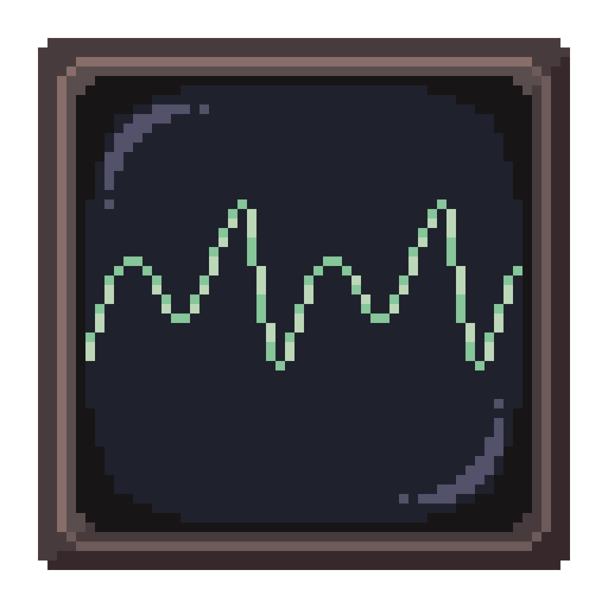
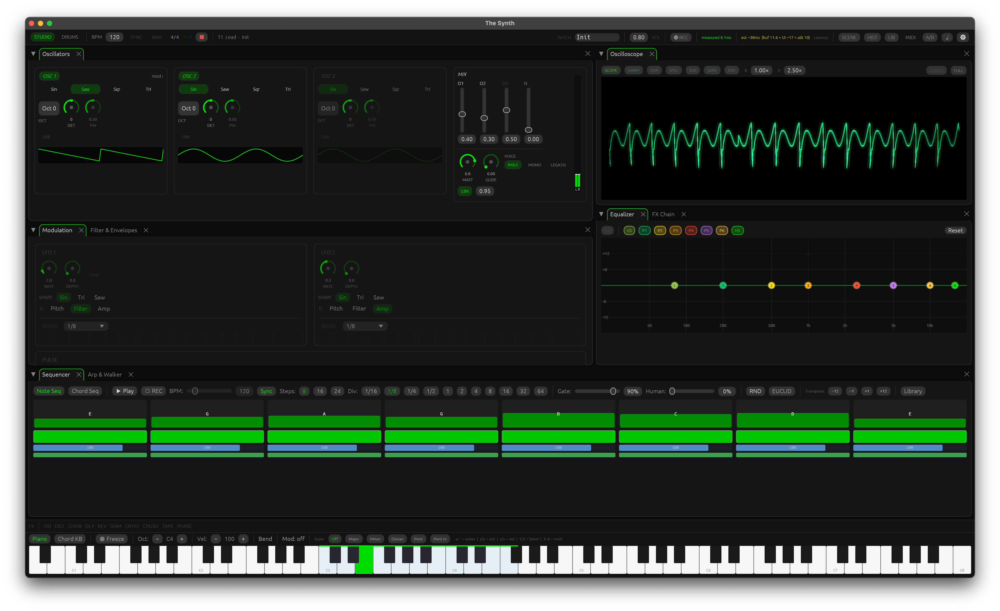
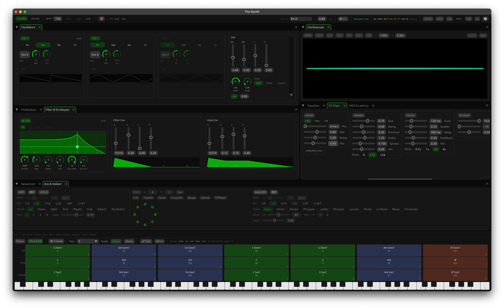
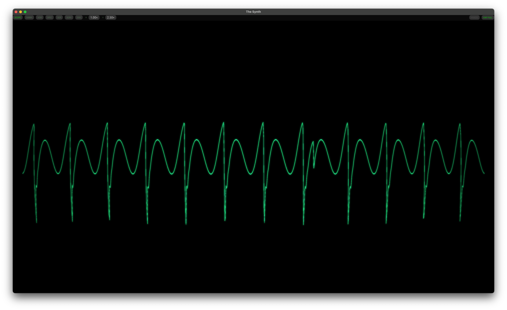

<div align="center">
  

# Forma

A polyphonic software synthesizer for macOS, built in Rust.

[](https://github.com/Ven7u/forma-synth/actions/workflows/ci.yml)

**[ven7u.github.io/forma-synth](https://ven7u.github.io/forma-synth/)**
</div>

> **Status:** Early development / personal project. **macOS only** — tested on macOS 15 Sequoia. Linux and Windows are untested.







---

## Features

### Sound engine
- **3 oscillators** — sine, saw, square (with pulse width), triangle, noise; per-oscillator volume and detune
- **Unison mode** — up to 5 detuned copies per oscillator with spread control
- **Hard sync** (OSC 1 resets OSC 2 phase)
- **FM synthesis** — OSC 2 modulates OSC 1 at audio rate
- **Ring modulation** — OSC 1 × OSC 2
- **8-voice polyphony** with oldest-first voice stealing and velocity sensitivity
- **Mono / legato mode** with glide / portamento
- **Moog-style 4-pole lowpass filter** — resonance, drive, key tracking, filter envelope (ADSR)
- **Amp envelope** (ADSR)
- **Output limiter** — lookahead true-peak limiter on the mix bus
- **8-band parametric EQ** — draggable-dot canvas, per-band enable/disable

### Modulation
- **2 independent LFOs** — multiple waveforms, BPM-syncable, gate-triggered retrigger
- **Mod matrix** — 4 free-routing slots (any source → any destination)
- **Aftertouch & mod wheel** routing
- **Pulse / gate lanes** — rhythmic amplitude and LFO modulation

### FX chain
Overdrive · Distortion · Chorus · Delay (BPM sync) · Reverb (Freeverb / Plate / FDN Hall) · Shimmer · Crystallizer

### Sequencer & arpeggiator
- **Step sequencer** — 16-step melodic patterns with chord and scale modes
- **Arpeggiator** — multiple modes, up to 4 octaves, BPM sync, gate control
- **Scale walker** — generative random walk within any scale
- **Scale highlight** — keyboard highlights valid notes for the active scale
- **Chord voicings** — built-in chord shapes with voice leading

### Drum machine
- **8 channels × 16 steps** — KICK, SNARE, HAT, CLAP, TOM×2, PERC, NOISE
- **4 pattern slots** (A/B/C/D) — copy, paste, clear
- **Per-step velocity** — drag up/down on any step
- **Euclidean rhythm generator** — per-lane hits/steps/offset
- **Voice editor** — per-channel synthesis params (base freq, pitch sweep, decay, noise mix)
- **Solo, Mute, Reverse, Randomize** per lane
- **Kit presets** — save/load/export named kits; 3 factory kits included

### MIDI
- **Auto-connect** — reconnects to last-used device on launch, rescans every 2 s if disconnected
- **MIDI learn** — click any knob, move a hardware CC to bind
- **Keyboard presets** — factory CC mappings for Arturia KeyLab MkIII, MiniLab MkIII, Generic
- **Patch navigation from hardware** — wheel to browse, buttons for favourites / randomize
- **Program Change** — jump to patch by index
- **MIDI monitor** — live feed of incoming messages for debugging mappings

### Patch management
- **171 factory presets** across 20 categories (Ambient, Cinematic, Lead, Pad, Bass, and more)
- **Patch library** with tag and category browser, favourites, recents
- **Patch history** — auto-snapshots every 3 s of silence + named manual pins, persisted across sessions

### Interface
- **Dockable panels** — drag and rearrange any panel
- **Multiple themes** — Midnight, Nord, Warm, and more
- **Oscilloscope** — realtime waveform display with latency meter
- **Keyboard widget** — on-screen playable keyboard with scale highlighting
- **Keyboard shortcuts** — GarageBand-style layout (`A`–`'` white keys, `W E T Y U O P` sharps, `Z/X` octave, `Space` freeze)

---

## Installing

### Homebrew (recommended)

```sh
brew tap ven7u/forma
brew trust ven7u/forma
brew install ven7u/forma/forma
```

Installs the `forma` binary — no Gatekeeper warning, no Rust required. Launch with `forma`. Updates via `brew upgrade ven7u/forma/forma`.

> **Prefer a .app bundle?** Use `brew install --cask forma` instead. You may need to run `xattr -cr /Applications/Forma.app` the first time due to macOS Gatekeeper.

### cargo install

Requires [Rust](https://rustup.rs) installed. Builds from source — no Gatekeeper warning.

```sh
cargo install --git https://github.com/Ven7u/forma-synth forma
```

### Download (macOS universal DMG)

Download the latest DMG from [Releases](https://github.com/Ven7u/forma-synth/releases/latest), open it and drag **Forma.app** to Applications.

> **"Forma is damaged and can't be opened"** — macOS Gatekeeper blocks unsigned apps. Fix with one of:
>
> - **Terminal:** `xattr -cr /Applications/Forma.app` then open normally
> - **Right-click** Forma.app → **Open** → **Open**
> - **System Settings** → Privacy & Security → **Open Anyway**

---

## Building

### Prerequisites

**Rust** (stable, 1.75+):
```sh
curl --proto '=https' --tlsv1.2 -sSf https://sh.rustup.rs | sh
```

**macOS** — no extra system dependencies needed. macOS 13+ recommended.

> **Linux / Windows:** the codebase uses cross-platform crates (cpal, egui) and should be portable, but has not been tested on these platforms yet. Contributions welcome.

### Run

```sh
git clone https://github.com/Ven7u/forma-synth.git
cd forma-synth
cargo run -p forma --release
```

The first build takes a few minutes — release mode enables LTO across the DSP crates.

### macOS app bundle

```sh
cargo install cargo-bundle --locked
cargo bundle --release -p forma
```

---

## Patch library

Presets are plain JSON files under `crates/forma/assets/patches/`. Each subdirectory is a category — drop a new `.json` file anywhere in the tree and it appears in the browser at next launch.

To save a patch from within the app: dial in your sound, type a name in the patch bar, and press **SAVE**.

---

## MIDI setup

Open the **MIDI & Latency** tab, select your device, and click your keyboard's name under **Keyboard Presets** to load a factory CC mapping. Use **MIDI Learn** to reassign any control.

For the Arturia KeyLab MkIII: the data wheel (CC 114) scrolls through patches, pressing it (CC 115) pins the current sound to history, and four buttons (CC 60–63) toggle favourites, navigate favourites, and randomize.

---

## Project structure

```
crates/
  forma/          ← desktop application (egui/eframe)
  forma-engine/   ← headless DSP engine: oscillators, filter, voice allocator
  forma-dsp/      ← DSP primitives: envelopes, effects, limiter
  forma-control/  ← MIDI parser, lock-free parameter protocol
  forma-common/   ← shared types (scales, clock divisions)
```

Other crates in the workspace are experimental and not part of the stable surface.

---

## License

Licensed under the [GNU General Public License v3.0](LICENSE).

Copyright © 2026 Francesco Ventura
